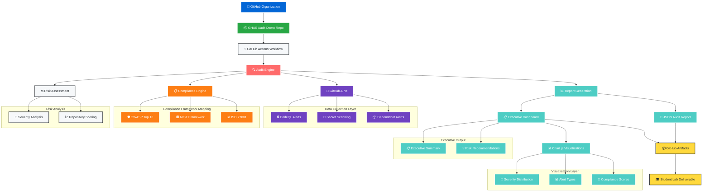

# GHAS Audit Workflow Architecture

## Overview
This diagram illustrates the end-to-end GitHub Advanced Security audit automation workflow for compliance reporting.

## Workflow Diagram

## Key Components

### 🔍 **Audit Engine**
- **Core processing** for security data collection
- **API integration** with GitHub Advanced Security
- **Risk calculation** and scoring algorithms

### 📋 **Compliance Engine**
- **OWASP Top 10** vulnerability mapping
- **NIST Cybersecurity Framework** alignment
- **ISO 27001** control mapping

### 📊 **Report Generation**
- **JSON structured data** for programmatic access
- **Executive dashboard** with interactive charts
- **Compliance evidence** for audit readiness

### 🎯 **Student Deliverables**
- **Forkable template** for hands-on learning
- **Customizable workflow** for different organizations
- **Production-ready** audit automation

## Usage Notes

- **Update organization name** in workflow configuration
- **Modify compliance mappings** as frameworks evolve
- **Add new visualization types** as needed
- **Extend API integrations** for additional tools

## Color Legend

- 🔵 **GitHub** - Source systems and repositories
- 🟢 **Repository** - Template and configuration
- 🔴 **Engine** - Core processing components
- 🟣 **API** - Data collection interfaces
- 🟠 **Compliance** - Framework alignment
- 🔵 **Output** - Reports and visualizations
- 🟡 **Deliverable** - Student lab artifacts

---

*Last Updated: 2024-01-XX*
*Maintainer: Tim Warner - Pluralsight GHAS Course*
